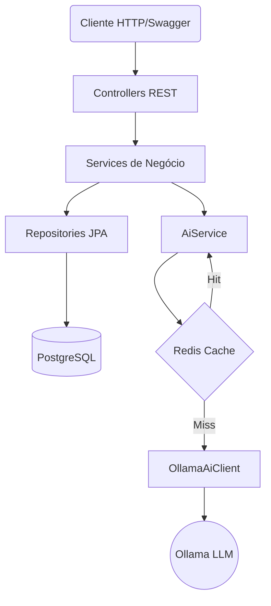

# Transactions API - Spring Boot


API REST moderna para gerenciamento de transações financeiras, integrando inteligência artificial local para classificação de gastos, análise de risco e resumos inteligentes.

## 🎯 Visão Geral

- **Gestão Financeira Completa**: Controle de depósitos, transferências e saldos com suporte a idempotência e segurança JWT.
- **Inteligência Artificial Nativa**: Classificação automática de transações e geração de resumos financeiros personalizados.
- **Arquitetura de Produção**: Foco em resiliência (fallbacks/retries), consistência de dados (locks pessimistas) e escalabilidade.

---

## 🏗️ Arquitetura

O sistema segue uma arquitetura em camadas, desacoplando a lógica de negócio da infraestrutura e dos serviços de IA.



---

## 🤖 Como a IA foi usada

A inteligência artificial é o diferencial deste projeto, utilizada para enriquecer os dados financeiros sem comprometer a estabilidade do sistema.

1.  **`classifyTransaction`**: O Ollama categoriza cada transação (ALIMENTAÇÃO, TRANSPORTE, etc.) com base na descrição fornecida via prompt.
2.  **`explainRisk`**: Gera explicações em linguagem natural sobre o nível de risco (HIGH/MEDIUM/LOW) de uma transação.
3.  **`generateSummary`**: Analisa o extrato do usuário e cria um resumo financeiro inteligente, agrupando gastos e sugerindo insights.
4.  **Resiliência (Fallback)**: Se o servidor de IA estiver offline ou falhar, a API utiliza valores padrão (ex: categoria "OUTROS"), garantindo que o fluxo principal nunca quebre.
5.  **Performance (Cache)**: Integração com **Redis** para cache de classificações (TTL 1h). Descrições repetidas não chamam a IA novamente.
6.  **Confiabilidade (Retry)**: Mecanismo de 2 tentativas automáticas em caso de falhas de rede, com filtro para não retentar em timeouts longos.

---

## 🛠️ Decisões Técnicas

| Decisão | Motivo |
| :--- | :--- |
| **Idempotency Key** | Evita transações duplicadas em caso de retentativas automáticas do cliente por falhas de rede. |
| **Pessimistic Lock** | Garante a consistência do saldo em transferências concorrentes, evitando "race conditions". |
| **Flyway** | Migrações de banco de dados versionadas e controladas, garantindo que o schema seja idêntico em todos os ambientes. |
| **JWT Stateless** | Autenticação escalável sem necessidade de manter estado de sessão no servidor. |
| **Fallback de IA** | Princípio de "Graceful Degradation": a funcionalidade principal (transação) deve funcionar mesmo se a IA falhar. |

---

## 🐳 Docker

A infraestrutura completa é orquestrada via Docker Compose, facilitando o setup em qualquer ambiente.

| Serviço | Imagem | Porta | Função |
| :--- | :--- | :--- | :--- |
| `app` | build local (Dockerfile) | 8080 | API Spring Boot Principal |
| `postgres` | postgres:16-alpine | 5433 | Banco de dados relacional persistente |
| `ollama` | ollama/ollama | 11434 | Servidor de LLM para execução local da IA |
| `redis` | redis:7-alpine | 6379 | Cache distribuído para classificações de IA |
| `pgadmin` | dpage/pgadmin4 | 5050 | Interface web para administração do PostgreSQL |

---

## 🚀 Quickstart

### 1. Subir infraestrutura
Certifique-se de ter o Docker instalado e execute:

```bash
docker-compose up -d
```

### 2. Aguardar Healthcheck
Aguarde alguns segundos até que todos os serviços estejam saudáveis. Verifique a API:

```bash
curl http://localhost:8080/api/health
```

### 3. Documentação
Acesse o Swagger UI para testar os endpoints:
`http://localhost:8080/swagger-ui/index.html`

---

## ⚙️ Variáveis de Ambiente

Principais configurações que podem ser sobrescritas:

| Variável | Valor Default | Descrição |
| :--- | :--- | :--- |
| `SPRING_DATASOURCE_URL` | `jdbc:postgresql://localhost:5433/transactions` | URL de conexão com o Postgres |
| `TRANSACTIONS_API_SECURITY_SECRET` | `1234567890` | Segredo para assinatura dos tokens JWT |
| `AI_OLLAMA_BASE_URL` | `http://localhost:11434` | URL do servidor Ollama |
| `AI_OLLAMA_MODEL` | `qwen3.5:4b` | Modelo de LLM a ser utilizado |
| `SPRING_DATA_REDIS_HOST` | `localhost` | Host do servidor Redis |

---

## 🛣️ Endpoints Principais

| Método | Rota | Auth | Descrição |
| :--- | :--- | :---: | :--- |
| `POST` | `/api/auth/register` | 🔓 | Registro de novo usuário |
| `POST` | `/api/auth/login` | 🔓 | Autenticação e obtenção de Token JWT |
| `POST` | `/api/transactions/deposit` | 🔐 | Realiza depósito em conta |
| `POST` | `/api/transactions/transfer` | 🔐 | Realiza transferência entre contas |
| `GET` | `/api/accounts/{id}/balance` | 🔐 | Consulta de saldo atual |
| `GET` | `/api/accounts/{id}/transactions`| 🔐 | Consulta de extrato detalhado |
| `GET` | `/api/insights/summary` | 🔐 | Geração de resumo inteligente via IA |
| `GET` | `/api/users` | 🔐 | Listagem de usuários (ADMIN apenas) |

---

## 👨‍💻 Autor

**Luiz Fernando**
- LinkedIn: [linkedin.com/in/luizfernando-java-developer/](https://www.linkedin.com/in/luizfernando-java-developer/)
- GitHub: [@luuizfernando](https://github.com/luuizfernando)

---
"Obrigado por visitar e bons códigos!" 🚀
